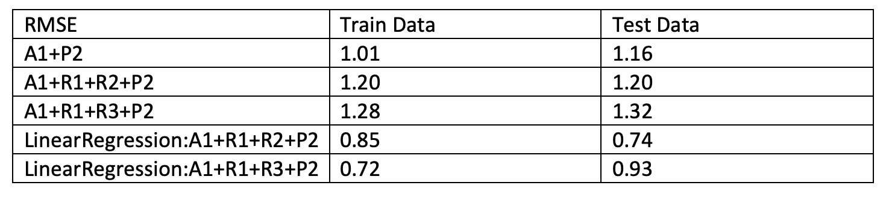

# Project 4: Algorithm implementation and evaluation: Collaborative Filtering

### [Project Description](doc/project4_desc.md)

Term: Spring 2020

+ Team 1
+ Project title: Algorithm implementation and evaluation: Collaborative Filtering
+ Team members
	+ Chen, Shenghan
	+ Chen, Shuyi
	+ Guo, Junyan 
	+ Heagy, David 
	+ Xie, Wenjie 
+ Project summary: In this project, we are going to ultilize matrix factorization methods for recommender system on the Netflix movies and ratings data, aiming to match consumers with most appropriate products. Matrix factorization methods represent both items and users with vectors of factors inferred from item rating patterns. High correspondence between item and user factors leads to a recommendation. 

Matrix factorization usually possess three parts. Our group has been assigned with the following algorithm, regularization and postprocessing:

- factorization algorithm: Stochastic Gradient Descent

- regularization: Penalty of Magnitudes + Bias and Interecepts vs Penalty of Magnitudes + Temporal Dynamics

- postpocessing: Singular value decomposition with K-nearest neighbor

We are going to compare the regularization methods given stochastic Gradien descent factorization algorithm and KNN post processing. Finally, we will combine the prediction through the linear regression process.

**Result**:

The best parameters for all models is F = 10, lambda = 0.1 .

As seen in the RMSE table, we observe that the RMSEs for A1+R1+R2+P2  for both train and test are larger than the RMSEs for A1+R1+R3+P2.

After the linear regression, we observe that the RMSEs for A1+R1+R2+P2 perform better than A1+R1+R3+P2  for both train and test. 

In conclusion, the best RMSEs after regularizations for both train and test come from the A1+R1+R2+P2. 

	
**Contribution statement**: [default] 
All team members contributed equally in all stages of this project. All team members approve our work presented in this GitHub repository including this contributions statement. 

+ Guo, Junyan: He conducted meetings, taking charge on R1+R3 factorization file, knn method and linear regression method. He did data transformation (mu, bi, bu, dev_u(t)) for fitting data in all methods and debugged the main file. 

+ Chen, Shuyi: She participated in meetings, She took charge of the A1+P2 model, wrote the report and PPT and did the presentation.

+ Heagy, David: He participated in meetings, implemented R1+R3 algorithm with Junyan Guo, debuged R1+R3 algorithm, and ran the R1+R2 algorithm on the whole dataset providing Rdata result. 

+ Xie, Wenjie: She participated in meetings, implemented R1+R2 algorithm, carried knn, linear regression method on R1+R2 regularized data.  

+ Chen, Shenghan: She participated in meetings, implemented R1+R2 algorithm with Wenjie Xie. 

Following [suggestions](http://nicercode.github.io/blog/2013-04-05-projects/) by [RICH FITZJOHN](http://nicercode.github.io/about/#Team) (@richfitz). This folder is orgarnized as follows.

```
proj/
├── lib/
├── data/
├── doc/
├── figs/
└── output/
```

Please see each subfolder for a README file.
