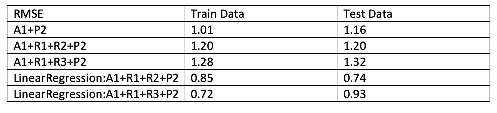

In this project, we are going to ultilize matrix factorization methods for recommender system, aiming to match consumers with most appropriate products. Matrix factorization methods represent both items and users with vectors of factors inferred from item rating patterns. High correspondence between item and user factors leads to a recommendation. 

Our group has been assigned with the following algorithm, regularization and postprocessing:

- factorization algorithm: Stochastic Gradient Descent

- regularization: Penalty of Magnitudes + Bias and Interecepts vs Penalty of Magnitudes + Temporal Dynamics

- postpocessing: KNN

We are going to compare the regularization methods and evaluate their results.

### Step 1 Load Data and Train-test Split

```{r include=FALSE}
library(dplyr)
library(tidyr)
library(ggplot2)
```


```{r}
data <- read.csv("../data/ml-latest-small/ratings.csv")

# did transformation on data for getting information in temporal dynamic
mean_time <- data%>%group_by(userId)%>%summarize(mean_time = mean(timestamp))
newdata <- left_join(data, mean_time, by="userId")
data <- newdata%>%mutate(sign = sign(timestamp-mean_time),diff_time = (abs(timestamp-mean_time)))

set.seed(0)
test_idx <- sample(1:nrow(data), round(nrow(data)/5, 0))
train_idx <- setdiff(1:nrow(data), test_idx)
data_train <- data[train_idx,]
data_test <- data[test_idx,]
```


###Step 2 Matrix Factorization

#### Step 2.1 Algorithm and Regularization
We perform stochastic gradien descent to do matrix factorization.

```{r}
U <- length(unique(data$userId))
I <- length(unique(data$movieId))
source("../lib/Matrix_Factorization.R")
```


#### Step 2.2 Parameter Tuning
Here we use cross validation to tune parameters: f as the dimension of factor and the penalty parameter $\lambda$ and select the best combination with the lowest test RMSE.

####Step 2.2.1 Parameter Tuning with A1:Stochastic Gradient Descent 

```{r}
source("../lib/cross_validation.R")
f_list <- seq(10, 20, 10)
l_list <- seq(-2, -1, 1)
f_l <- expand.grid(f_list, l_list)
```


```{r, eval=FALSE}
# result_summary <- array(NA, dim = c(nrow(f_l), 10, 4)) 
# run_time <- system.time(for(i in 1:nrow(f_l)){
#     par <- paste("f = ", f_l[i,1], ", lambda = ", 10^f_l[i,2])
#     cat(par, "\n")
#     current_result <- cv.function(data, K = 5, f = f_l[i,1], lambda = 10^f_l[i,2])
#     result_summary[,,i] <- matrix(unlist(current_result), ncol = 10, byrow = T) 
#     print(result_summary)
#   
# })
# 
# save(result_summary, file = "../output/rmse.Rdata")
```


Plot the tuned parameters for A1: Stochastic Gradient Descent

```{r}
load("../output/rmse.Rdata")
rmse <- data.frame(rbind(t(result_summary[1,,]), t(result_summary[2,,])), train_test = rep(c("Train", "Test"), each = 4), par = rep(paste("f = ", f_l[,1], ", lambda = ", 10^f_l[,2]), times = 2)) %>% gather("epoch", "RMSE", -train_test, -par)
rmse$epoch <- as.numeric(gsub("X", "", rmse$epoch))
rmse %>% ggplot(aes(x = epoch, y = RMSE, col = train_test)) + geom_point() + facet_grid(~par)
```

From the graphs, we can observe that the f = 10. lambda = 0.1 maintain the best performance matrics with lowest test RMSE.


#### Step 2.2.2 Parameter Tuning with  R1 + R2 and R1+R3

```{r}
source("../lib/cross_validation_r1+r2.R")
source("../lib/Matrix_Factorization_r1+r2.R")
source("../lib/Matrix_Factorization_r1r3.R")
f_list <- seq(10, 20, 10)
l_list <- seq(-2, -1, 1)
f_l <- expand.grid(f_list, l_list)

# result_summary_r12 <- array(NA, dim = c(nrow(f_l), 10, 4)) 
# run_time <- system.time(for(i in 1:nrow(f_l)){
#     par <- paste("f = ", f_l[i,1], ", lambda = ", 10^f_l[i,2])
#     cat(par, "\n")
#     current_result <- cv.function.r12(data, K = 5, f = f_l[i,1], lambda = 10^f_l[i,2])
#     result_summary_r12[,,i] <- matrix(unlist(current_result), ncol = 10, byrow = T) 
#     print(result_summary_r12)
#   
# })
# 

```


#### Evaluation RMSE for A1 

RMSE Function
```{r}
RMSE2 <- function(rating,est_rating){
  sqrt(mean((rating$rating-est_rating)^2))
}
```


```{r, warning=FALSE}
#result <- gradesc(f = 10, lambda = 0.1,lrate = 0.01, max.iter = 100, #stopping.deriv = 0.01,
#                   data = data, train = data_train, test = data_test)

#save(result, file = "../output/mat_fac.RData")
```


```{r}
load(file = "../output/rmse.Rdata")
load(file = "../output/mat_fac.Rdata")
  
pred_rating <- t(result$q) %*% result$p
rmse_sgd <- RMSE2(data_test,pred_rating)
cat("The RMSE of A1 model is", rmse_sgd)
```


####RMSE for A1 + R1R3

####Parameter tuniing for A1 + R1R3 
```{r}
# result_R1R3 <- gradesc.r3(f = 10, lambda = 0.1,lrate = 0.01, max.iter = 30, stopping.deriv = 0.01,
#                    data = data, train = data_train, test = data_test)
# 
# save(result_R1R3, file = "../output/result_R1R3.RData")
```


```{r, warning=FALSE}
load(file = "../output/result_R1R3.RData")

# load results from matrix factorization
pred_rating13 <- t(result_R1R3$q) %*% result_R1R3$p
alpha <- result_R1R3$alpha

# compute all metrics needed for ratings
mu <- mean(data_train$rating)
bi <- data_train%>%group_by(movieId)%>%summarize(bi = mean(rating)-mu)%>%arrange(movieId)
bu <- data_train%>%group_by(userId)%>%summarize(bu = mean(rating)-mu)%>%arrange(userId)
dev_u_t_train <- data_train[,6]*(data_train[,7]^0.01)
dev_u_t_test <- data_test[,6]*(data_test[,7]^0.01)
bi_train <- c()
bi_test <- c()
bu_train <- c()
bu_test <- c()
data_train_pred <- c()
dev_train <-c()

for(i in 1:nrow(data_train)){
  data_train_pred[i]<-pred_rating13[which(rownames(pred_rating13)==data_train$movieId[i]),which(colnames(pred_rating13)==data_train$userId[i])]
  dev_train[i] <- alpha[which(names(alpha)==data_train$userId[i])]*dev_u_t_train[i]
  bi_train[i] <- bi$bi[which(bi$movieId==data_train$movieId[i])]
  bu_train [i] <- bu$bu[which(bu$userId==data_train$userId[i])]
}
# the function of gettting predicted ratings for training set
pred_train_new <- data_train_pred+bi_train+bu_train+mu+dev_train

data_test_pred <- c()
dev_test <-c()
for(i in 1:nrow(data_test)){
  data_test_pred[i]<-pred_rating13[which(rownames(pred_rating13)==data_test$movieId[i]),which(colnames(pred_rating13)==data_test$userId[i])]
  dev_test[i] <- alpha[which(names(alpha)==data_test$userId[i])]*dev_u_t_test[i]
  bi_test[i] <- ifelse(length(bi$bi[which(bi$movieId==data_test$movieId[i])])==0,0,bi$bi[which(bi$movieId==data_test$movieId[i])])
  bu_test [i] <- ifelse(length(bu$bu[which(bu$userId==data_test$userId[i])])==0,0,bu$bu[which(bu$userId==data_test$userId[i])])
}
# the function of gettting predicted ratings for test set
pred_test_new <- data_test_pred+bi_test+bu_test+mu+dev_test

rmse_r3_train <- RMSE2(data_train,pred_train_new)
rmse_r3_test <- RMSE2(data_test,pred_test_new)
cat("The test RMSE of A1 with R1 and R3  model is", rmse_r3_test,"\n")
cat("The training RMSE of A1 with R1 and R3  model is", rmse_r3_train)
```

####RMSE for A1 + R1+R2

```{r}
# resultR12 <- gradesc.r12(f = 10, lambda = 0.1,lrate = 0.01, max.iter = 1, stopping.deriv = 0.01,
#                     data = data, train = data_train, test = data_test)
#  
# save(resultR12, file = "../output/mat_fac_r12.RData")
```

```{r, warning=FALSE}
load(file = "../output/mat_fac_r12.RData")
pred_rating12 <- t(resultR12$q) %*% resultR12$p
rmse_r12 <- RMSE2(data_test,pred_rating12)
cat("The RMSE of A1 with R1 R2 model is", rmse_r12)
```

```{r}
bi_train12 <- c()
bi_test12 <- c()
bu_train12 <- c()
bu_test12 <- c()
data_train_pred12 <- c()
for(i in 1:nrow(data_train)){
  data_train_pred12[i] <- pred_rating12[which(rownames(pred_rating12)==data_train$movieId[i]),which(colnames(pred_rating12)==data_train$userId[i])]
  bi_train12[i] <- bi$bi[which(bi$movieId==data_train$movieId[i])]
  bu_train12[i] <- bu$bu[which(bu$userId==data_train$userId[i])]
}

pred_train_12 <- data_train_pred12+bi_train+bu_train+mu

data_test_pred12 <- c()
for(i in 1:nrow(data_test)){
  data_test_pred12[i]<-pred_rating12[which(rownames(pred_rating12)==data_test$movieId[i]),which(colnames(pred_rating12)==data_test$userId[i])]
  bi_test12[i] <- ifelse(length(bi$bi[which(bi$movieId==data_test$movieId[i])])==0,0,bi$bi[which(bi$movieId==data_test$movieId[i])])
  bu_test12[i] <- ifelse(length(bu$bu[which(bu$userId==data_test$userId[i])])==0,0,bu$bu[which(bu$userId==data_test$userId[i])])
}

pred_test_12 <- data_test_pred12+bi_test+bu_test+mu
```


Before adding the regularization, our RMSE for A1 test datasets are 1.92. After adding the regularization, our RMSE for A1+R1+R2 for train and test datasets have been increased to 3.64 and 3.70 which means our the regularization might decrease the possibilities of overfitting problem. 

After adding the regularization, our RMSE for A1+R1+R3 for train and test datasets have been increased to 1.27 and 1.31.

### Step 3 Postprocessing with KNN
After matrix factorization, postporcessing with KNN will be performed to improve accuracy.

KNN Function
```{r}
vec <- function(x) {
  
  return(sqrt(sum(x^2)))
  
  }

pred_knn <- function(data_train, data_test, q){
  
  norm_q <- apply(q,2,vec)
  sim <- t(t((t(q) %*% q)/ norm_q) / norm_q)
  colnames(sim) <- colnames(q)
  rownames(sim) <- colnames(q)
  pred_test <- rep(0,nrow(data_test))
  
  for (i in 1:nrow(data_test)){
    user_id <- data_test$userId[i]
    movie_id <- data_test$movieId[i]
    train <- data_train[data_train$userId == user_id & data_train$movieId != movie_id,]
    movie_train <- train$movieId
    sim_vec <- sim[rownames(sim) == movie_id, colnames(sim) %in% movie_train]
    movie <- names(sim_vec)[which.max(sim_vec)]
    pred_test[i] <- train[train$movieId == movie,][3]
  }
  
  pred_test <- as.matrix(unlist(pred_test))
  rmse_test <- sqrt(mean((data_test$rating-pred_test)^2))
  return(list(pred_test = pred_test, rmse_test = rmse_test))
  
}
```


####RMSE for A1+P2
```{r}
q <- result$q
p2_result_test <- pred_knn(data_train = data_train, data_test = data_test, q)
test_rmse_p2 <- p2_result_test['rmse_test']
p2_result_train <- pred_knn(data_train = data_train, data_test = data_train, q)
train_rmse_p2 <- p2_result_train['rmse_test']
cat("The RMSE of A1 with P2 model is", as.numeric(test_rmse_p2))
cat("The train RMSE of A1 with P2 model is", as.numeric(train_rmse_p2),"\n")
```

####RMSE for A1+R1+R2+P2
```{r}
q <- resultR12$q
p2_result_test12 <- pred_knn(data_train = data_train, data_test = data_test, q)
test_rmse_p2 <- p2_result_test12['rmse_test']
p2_result_train12 <- pred_knn(data_train = data_train, data_test = data_train, q)
train_rmse_p2 <- p2_result_train12['rmse_test']
cat("The test RMSE of A1 and R1+R2 with P2 model is", as.numeric(test_rmse_p2),"\n")
cat("The training RMSE of A1 and R1+R2 with P2 model is", as.numeric(train_rmse_p2))
```

###RMSE for A1+R1+R3+P2
```{r}
q <- result_R1R3$q
p2_result_test13 <- pred_knn(data_train = data_train, data_test = data_test, q)
test_rmse_p2 <- p2_result_test13['rmse_test']
p2_result_train13 <- pred_knn(data_train = data_train, data_test = data_train, q)
train_rmse_p2 <- p2_result_train13['rmse_test']
cat("The test RMSE of A1 and R1+R3 with P2 model is", as.numeric(test_rmse_p2),"\n")
cat("The training RMSE of A1 and R1+R3 with P2 model is", as.numeric(train_rmse_p2))
```


Then we run Linear Regression to get the parameters for each indicators.

###Linear Regression for A1+R1+R2+P2

```{r}
knn <- p2_result_test12$pred_test
t_test12 <- tibble(knn = p2_result_test12$pred_test,
                 bi = bi_test12,
                 bu = bu_test12,
                 qp = data_test_pred12)
t_train12 <- tibble(y = data_train$rating,
                  knn = p2_result_train12$pred_test,
                  bi = bi_train12,
                  bu = bu_train12,
                  qp = data_train_pred12)
lm12 <- lm(y-mu~.,data=t_train12)
summary(lm12)
```


```{r}
pred_new <- predict(lm12,t_test)
true_vec <- data_test$rating-mu
error_l12 <- sqrt(mean((true_vec - pred_new)^2))
error_l12 <- cat("The test RMSE of A1 and R1+R2 with P2 linear model is", as.numeric(error_l12),"\n")

pred_new <- predict(lm13,t_train%>%select(-y))
true_vec <- t_train$y - mu
error_l12 <- sqrt(mean((true_vec - pred_new)^2))
error_l12 <- cat("The training RMSE of A1 and R1+R2 with P2 linear model is", as.numeric(error_l12))
```


###Linear Regression for A1+R1+R3+P2
```{r}
knn <- p2_result_test13$pred_test
t_test <- tibble(knn = p2_result_test13$pred_test,
                 bi = bi_test,
                 bu = bu_test,
                 qp = data_test_pred,
                 dev = dev_test)
t_train <- tibble(y = data_train$rating,
                  knn = p2_result_train13$pred_test,
                  bi = bi_train,
                  bu = bu_train,
                  qp = data_train_pred,
                  dev = dev_train)
lm13 <- lm(y-mu~.,data=t_train)
summary(lm13)
```

```{r}
pred_new <- predict(lm13,t_test)
true_vec <- data_test$rating-mu
error_l13 <- sqrt(mean((true_vec - pred_new)^2))
error_l13 <- cat("The test RMSE of A1 and R1+R3 with P2 linear model is", as.numeric(error_l13),"\n")

pred_new <- predict(lm13,t_train%>%select(-y))
true_vec <- t_train$y - mu
error_l13 <- sqrt(mean((true_vec - pred_new)^2))
error_l13 <- cat("The training RMSE of A1 and R1+R3 with P2 linear model is", as.numeric(error_l13))
```


###Step 4: Result summary and evaluation
####Result Summary


Train RMSE for A1 + P2: 1.01
Test RMSE for A1 + P2 : 1.16

Train RMSE for A1 + R1R2: 3.64
Test RMSE for A1 + R1R2: 3.70

Train RMSE for A1 + R1R2 +P2: 1.27
Test RMSE for A1 + R1R2 + P2 : 1.15

Train RMSE for A1 + R1R3 (combination): 0.73
Test RMSE for A1 + R1R3 (combination): 0.91 

Train RMSE for A1 + R1R3 +P2: 1.28
Test RMSE for A1 + R1R3 +P2: 1.32


Linear regression results:

Linear regression Train RMSE for A1 + R1R2 + P2 : 0.74
Linear regression Test RMSE for A1 + R1R2 + P2 :  0.85

Linear regression Train RMSE for A1 + R1R3 + P2 : 0.72
Linear regression Test RMSE for A1 + R1R3 + P2 : 0.93


{width=600px}


The best parameters for all models is F = 10, lambda = 0.1 .
As seen in the RMSE table, we observe that the RMSEs for A1+R1+R2+P2  for both train and test are larger than the RMSEs for A1+R1+R3+P2.

After the linear regression, we observe that the RMSEs for A1+R1+R2+P2 perform better than A1+R1+R3+P2  for both train and test. 

In conclusion, the best RMSEs after regularizations for both train and test come from the A1+R1+R2+P2. 


